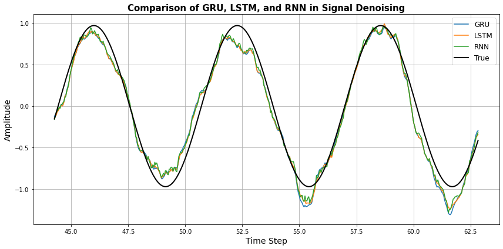

# RNN vs LSTM vs GRU _ Denoising a Noisy Signal

This project compares the performance of three recurrent neural network architectures — **SimpleRNN**, **LSTM**, and **GRU** — for denoising a noisy sine wave signal.

Each model is trained multiple times to reduce randomness, and we report **average RMSE and standard deviation** to ensure fair comparison.

---
## RNN vs LSTM vs GRU — What's the Difference?
| Model    | Memory      | Vanishing Gradient | Complexity | Training Time    | Best For                                 |
| -------- | ----------- | ------------------ | ---------- | ---------------- | ---------------------------------------- |
| **RNN**  | Short       |  Susceptible      | Low        | Fast             | Simple, short-sequence tasks             |
| **LSTM** | Long        |  Handles well     | High       | Slower           | Complex sequences, long-term memory      |
| **GRU**  | Medium-Long |  Handles well     | Medium     | Faster than LSTM | Similar to LSTM, slightly more efficient |

## Why LSTM Performs Better

- Long-Term Dependency Handling: LSTM uses cell states and gating mechanisms (input, forget, output gates) that allow it to retain important information over long sequences and filter out noise more effectively than vanilla RNNs.
- Stable Training: LSTM is designed to overcome the vanishing gradient problem, which standard RNNs often suffer from during backpropagation through time.
- More Control: LSTM can choose what to keep or forget, which is crucial for filtering noisy signals.

- ## Real World Use Cases
| Application                        | Suitable Model(s) | Why                                               |
| ---------------------------------- | ----------------- | ------------------------------------------------- |
| **EEG / ECG / EMG denoising**      | LSTM / GRU        | Handles temporal noise & variability well         |
| **Speech Recognition**             | GRU / LSTM        | Captures phoneme-to-word relationships            |
| **Stock Prediction**               | LSTM              | Long-term memory and sensitivity to time          |
| **IoT Sensor Data Cleaning**       | GRU               | Fast, energy-efficient, suitable for edge devices |
| **Machine Translation / NLP**      | LSTM              | Understands sequence semantics over long context  |
| **Sleep Stage Detection from EEG** | LSTM              | Temporal dependencies in biosignals               |

- RNN is lightweight but struggles with long-term dependencies and noisy data.
- GRU offers a great balance between performance and efficiency.
- LSTM is most powerful for denoising and prediction tasks involving long sequences or complex patterns — as proven in our experiment.
- **Use LSTM for biosignals, time-series forecasting, or any task where noise suppression and long-term dependencies matter.**

## What’s in the Code

- Creates a noisy sine wave signal
- Normalizes the data
- Trains:
  - RNN
  - LSTM
  - GRU
- Runs each model **7 times**
- Computes:
  - Average predictions
  - RMSE ± Standard Deviation
- Visualizes output for each model

---

## Experimental Setup

- Signal: sin(t) sampled over [0, 20π]
- Noise: Gaussian noise (μ=0, σ=0.5)
- Normalization: MinMaxScaler
- Sequence Window: 20 samples
- Hidden Units: 50
- Training Iterations per model: 7
- Loss: Mean Squared Error (MSE)
- Train/Test Split: 70% / 30%

---

## Why Multiple Runs?

Neural networks are **stochastic** results vary per training.  
To **trust the results**, we:
- Train each model **7 times**
- Take **average prediction**
- Report **mean ± std of RMSE**

---

## Visualization

---

## Results Sample
| Model    | RMSE (Mean ± Std) |
| -------- | ----------------- |
| **RNN**  | 0.1449 ± 0.0210   |
| **GRU**  | 0.1402 ± 0.0074   |
| **LSTM** | 0.1313 ± 0.0032   |

---

## Author

Sahar Jahani  
[GitHub Profile](https://github.com/Jahani-dev)
